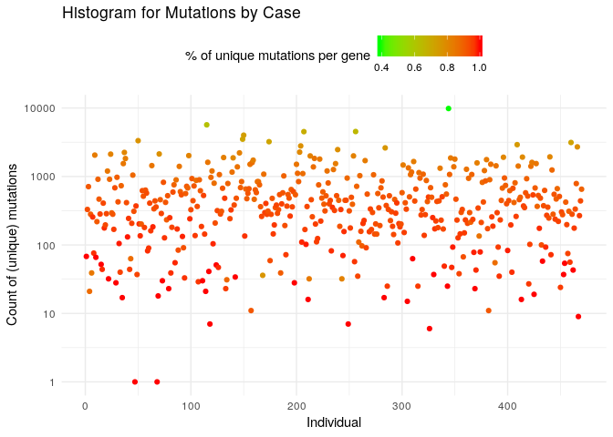

Import BRCA dataset from TCGA
================
André Veríssimo *and* Marta Lopes
November 2016

-   [Package information](#package-information)
    -   [How to use the dataset](#how-to-use-the-dataset)
        -   [Example](#example)
    -   [Description of the data set](#description-of-the-data-set)
        -   [Explaining the TCGA codes](#explaining-the-tcga-codes)
-   [Script to generate the package data](#script-to-generate-the-package-data)
    -   [Loading data from TCGA](#loading-data-from-tcga)
        -   [TCGAbiolinks package](#tcgabiolinks-package)
        -   [Auxiliary libraries and functins to be used](#auxiliary-libraries-and-functins-to-be-used)
        -   [Extracting all the barcodes](#extracting-all-the-barcodes)
    -   [Processing the data](#processing-the-data)
        -   [Mapping all types of sample (tumor, normal, metastases, control...)](#mapping-all-types-of-sample-tumor-normal-metastases-control...)
        -   [Size of data from each tissue](#size-of-data-from-each-tissue)
        -   [Store all patient's barcode from `tissue` in `tissue.barcode`](#store-all-patients-barcode-from-tissue-in-tissue.barcode)
        -   [Store patient's clinical data](#store-patients-clinical-data)
        -   [Mutations](#mutations)
    -   [Exported data](#exported-data)

Package information
===================

How to use the dataset
----------------------

1.  Install brca.data by using `devtools` package.

2.  Load the library

3.  Load the required datasets (one or more of the following)
    -   `clinical`
    -   `tissue`
    -   `tissue.all`
    -   `tissue.barcode`
    -   `tissue.ix`
    -   `mutation`
    -   `gdc`

### Example

``` r
# load library or use directly if insta
install.packages('devtools')
# The library can also be loaded and use the function install_git without 'devtools::' prefix
devtools::install_git('http://sels.tecnico.ulisboa.pt/gitlab/averissimo/rpackage-brca.git')
#
# Load the brca.data package
library(brca.data)
# start using the data, for example the tissue data
data(tissue)
# tissue is now in the enviromnet and will be loaded on the first
#  time it is used. For example:
names(tissue)
```

Description of the data set
---------------------------

The Cancer Genome Atlas Breast Invasive Carcinoma (TCGA-BRCA) data collection is part of a larger effort to build a research community focused on connecting cancer phenotypes to genotypes by providing clinical images matched to subjects from The Cancer Genome Atlas ([TCGA](https://cancergenome.nih.gov/)).

The BRCA data is publicly available (<https://gdc-portal.nci.nih.gov/>) and is decomposed into two data sets:

1.  the gene expression data, composed of `57251` variables for a total of `1222` samples with `1097` individuals. From those samples, `1102` with primary solid tumor, `7` metastatic and `113` with normal tissue;

2.  the clinical data is composed of 113 variables obtained from the same individuals. (much more is available in the gdc data variable, such as follow\_up, drug, radiation, ...)

### Explaining the TCGA codes

The following links explain (1) the individuals' barcode and (2) the sample type code:

1.  [Link to individuals' barcode from tcga](https://wiki.nci.nih.gov/display/TCGA/TCGA+barcode?desktop=true&macroName=unmigrated-inline-wiki-markup)

2.  [Link to sample type code from tcga](https://gdc.cancer.gov/resources-tcga-users/tcga-code-tables/sample-type-codes)

Explanation of TCGA barcode using example `TCGA-02-0001-01C-01D-0182-01`


<table>
<colgroup>
<col width="17%" />
<col width="25%" />
<col width="9%" />
<col width="24%" />
<col width="22%" />
</colgroup>
<thead>
<tr class="header">
<th>Label</th>
<th>Identifier for</th>
<th>Value</th>
<th>Value Description</th>
<th>Possible Values</th>
</tr>
</thead>
<tbody>
<tr class="odd">
<td>Project</td>
<td>Project name</td>
<td>TCGA</td>
<td>TCGA project</td>
<td>TCGA</td>
</tr>
<tr class="even">
<td>TSS</td>
<td>Tissue source site</td>
<td>02</td>
<td>GBM (brain tumor) sample from MD Anderson</td>
<td>See <a href="https://gdc.cancer.gov/resources-tcga-users/tcga-code-tables/tissue-source-site-codes">Code Tables Report</a></td>
</tr>
<tr class="odd">
<td>Participant</td>
<td>Study participant</td>
<td>0001</td>
<td>The first participant from MD Anderson for GBM study</td>
<td>Any alpha-numeric value</td>
</tr>
<tr class="even">
<td>Sample</td>
<td>Sample type</td>
<td>01</td>
<td>A solid tumor</td>
<td>Tumor types range from 01 - 09, normal types from 10 - 19 and control samples from 20 - 29. See <a href="https://gdc.cancer.gov/resources-tcga-users/tcga-code-tables/sample-type-codes">Code Tables Report</a> for a complete list of sample codes</td>
</tr>
<tr class="odd">
<td>Vial</td>
<td>Order of sample in a sequence of samples</td>
<td>C</td>
<td>The third vial</td>
<td>A to Z</td>
</tr>
<tr class="even">
<td>Portion</td>
<td>Order of portion in a sequence of 100 - 120 mg sample portions</td>
<td>01</td>
<td>The first portion of the sample</td>
<td>01-99</td>
</tr>
<tr class="odd">
<td>Analyte</td>
<td>Molecular type of analyte for analysis</td>
<td>D</td>
<td>The analyte is a DNA sample</td>
<td>See <a href="https://gdc.cancer.gov/resources-tcga-users/tcga-code-tables/portion-analyte-codes">Code Tables Report</a></td>
</tr>
<tr class="even">
<td>Plate</td>
<td>Order of plate in a sequence of 96-well plates</td>
<td>0182</td>
<td>The 182nd plate</td>
<td>4-digit alphanumeric value</td>
</tr>
<tr class="odd">
<td>Center</td>
<td>Sequencing or characterization center that will receive the aliquot for analysis</td>
<td>01</td>
<td>The Broad Institute GCC</td>
<td>See <a href="https://gdc.cancer.gov/resources-tcga-users/tcga-code-tables/center-codes">Code Tables Report</a></td>
</tr>
</tbody>
</table>

Script to generate the package data
===================================

``` r
#
#
#
#
# This now documents the generation of the dataset.
#
# No longer a generic documentation of the package!
#
# 
#
```

Loading data from TCGA
----------------------

### TCGAbiolinks package

The BRCA data set can also be extracted through the [TCGAbiolinks R bioconductor package](https://bioconductor.org/packages/release/bioc/html/TCGAbiolinks.html)

``` r
source("https://bioconductor.org/biocLite.R")
biocLite("TCGAbiolinks")
```

#### Download BRCA data (project: *TCGA-BRCA*)

Change `project` variable to get other data projects in TCGA.

``` r
library(TCGAbiolinks)
project <- 'TCGA-BRCA'
cached.file <- 'tcga-biolinks-cache.RData'
if (file.exists(cached.file)) {
  load(cached.file)
} else {
  query <- list()
  # Query the GDC to obtain data
  query$clinical <- GDCquery(project = project,
                             data.category = "Clinical")
  # Download query data
  GDCdownload(query$clinical, method = 'api')
  # Prepare R object with data
  gdc <- list()
  gdc$clinical        <- GDCprepare_clinic(query$clinical, 'patient')
  gdc$drug            <- GDCprepare_clinic(query$clinical, 'drug')
  gdc$radiation       <- GDCprepare_clinic(query$clinical, 'radiation')
  gdc$admin           <- GDCprepare_clinic(query$clinical, 'admin')
  gdc$follow.up       <- GDCprepare_clinic(query$clinical, 'follow_up')
  gdc$stage_event     <- GDCprepare_clinic(query$clinical, 'stage_event')
  gdc$new_tumor_event <- GDCprepare_clinic(query$clinical, 'new_tumor_event')
  #
  query$rnaseq <- GDCquery(project = project,
                           data.category = "Transcriptome Profiling",
                           data.type     = "Gene Expression Quantification",
                           workflow.type = "HTSeq - FPKM")
  #
  GDCdownload(query$rnaseq, method = 'api')
  gdc$rnaseq <- GDCprepare(query$rnaseq)
  #
  query$mutation <- GDCquery(project = project,
                             data.category = "Simple Nucleotide Variation",
                             data.type     = "Masked Somatic Mutation",
                             workflow.type = "MuSE Variant Aggregation and Masking")
  GDCdownload(query$mutation, method = 'api')
  gdc$mutation <- GDCprepare(query$mutation)
  # clean up table by removing all rows that are NA
  gdc$mutation <- gdc$mutation[,colSums(is.na(gdc$mutation)) != nrow(gdc$mutation)]
  #
  save(gdc, query,
       file = cached.file)
}
```

### Auxiliary libraries and functins to be used

``` r
# Library to print some information
library(futile.logger)
library(ggplot2)
library(tibble)
library(dplyr)
```

    ## 
    ## Attaching package: 'dplyr'

    ## The following objects are masked from 'package:stats':
    ## 
    ##     filter, lag

    ## The following objects are masked from 'package:base':
    ## 
    ##     intersect, setdiff, setequal, union

``` r
library(Matrix)
#
# this is distributed as part of the package
getParticipant <- function(fullBarcode) {
  source('R/functions.R')
  getParticipantCode(fullBarcode)
}
getSample <- function(fullBarcode) {
  source('R/functions.R')
  getSampleTypeCode(fullBarcode)
}
```

### Extracting all the barcodes

Pattern to retrieve TCGA patient and sample type from extended barcode.

``` r
# $1 gets the TCGA participant portion
# $2 gets the sample type
tcga.barcode.pattern <- '(TCGA-[A-Z0-9a-z]{2}-[a-zA-Z0-9]{4})-([0-9]{2}).+'
#
# patient barcode for each column in tcga.data$dat
tissue.barcode <- list()
tissue.barcode$all <- getParticipant(gdc$rnaseq@colData$barcode)
#
# getting all tisues
tissue <- list()
tissue$all <- as.matrix(gdc$rnaseq@assays$data[['HTSeq - FPKM']])
colnames(tissue$all) <- gdc$rnaseq@colData$barcode
#
rownames(tissue$all) <- gdc$rnaseq@rowRanges$ensembl_gene_id
#
gene.ranges <- gdc$rnaseq@rowRanges
#
# clinical data
clinical <- list()
clinical$all <- gdc$clinical
```

Processing the data
-------------------

### Mapping all types of sample (tumor, normal, metastases, control...)

See [Code Tables Report](https://gdc.cancer.gov/resources-tcga-users/tcga-code-tables/sample-type-codes) for a complete list of sample codes.

``` r
# sample type per sample
tissue.type  <- as.numeric(getSample(colnames(tissue$all)))
#
# mapping for tissue type
tissue.mapping <- list( 
  'primary.solid.tumor' = 01,
  'recurrent.solid.tumor' = 02,
  'primary.blood.derived.cancer.peripheral.blood' = 03,
  'recurrent.blood.derived.cancer.bone.marrow' = 04,
  'additional.new.primary' = 05,
  'metastatic' = 06,
  'additional.metastatic' = 07,
  'human.tumor.original.cells' = 08,
  'primary.blood.derived.cancer.bone.marrow' = 09,
  'blood.derived.normal' = 10,
  'solid.tissue.normal' = 11,
  'buccal.cell.normal' = 12,
  'ebv.immortalized.normal' = 13,
  'bone.marrow.normal' = 14,
  'sample.type.15' = 15,
  'sample.type.16' = 16,
  'control.analyte' = 20,
  'recurrent.blood.derived.cancer.peripheral.blood' = 40,
  'cell.lines' = 50,
  'primary.xenograft.tissue' = 60,
  'cell.line.derived.xenograft.tissue' = 61,
  'sample.type.99' = 99
)
#
# Types of tissues
tissue.ix <- list()
for (el in names(tissue.mapping)) {
  tissue.ix[[el]] <- (tissue.type == tissue.mapping[[el]])
  if (any(tissue.ix[[el]]))
    tissue[[el]] <- tissue$all[,tissue.ix[[el]]]
}
```

### Size of data from each tissue

``` r
sample.size <- c()
for (el in names(tissue)) {
  sample.size <- rbind(sample.size, c(ncol(tissue[[el]]), nrow(tissue[[el]])))
}
rownames(sample.size) <- names(tissue)
colnames(sample.size) <- c('# of Samples', '# of Genes')
futile.logger::flog.info('Tissue information per tissue type:', sample.size, capture = TRUE)
```

    ## INFO [2016-11-22 22:09:45] Tissue information per tissue type:
    ## 
    ##                     # of Samples # of Genes
    ## all                         1222      57251
    ## primary.solid.tumor         1102      57251
    ## metastatic                     7      57251
    ## solid.tissue.normal          113      57251

### Store all patient's barcode from `tissue` in `tissue.barcode`

``` r
for (el in names(tissue)) {
  tissue.barcode[[el]] <- getParticipant(colnames(tissue[[el]]))
}
```

### Store patient's clinical data

``` r
for (el in names(tissue)) {
  clinical[[el]] <- clinical$all[tissue.barcode[[el]],]
}
sample.size <- c()
for (el in names(clinical)) {
  sample.size <- rbind(sample.size, c(nrow(clinical[[el]]), ncol(clinical[[el]])))
}
rownames(sample.size) <- names(tissue)
colnames(sample.size) <- c('# of Samples', '# of Features')
futile.logger::flog.info('Clinical information per tissue type:', sample.size, capture = TRUE)
```

    ## INFO [2016-11-22 22:09:45] Clinical information per tissue type:
    ## 
    ##                     # of Samples # of Features
    ## all                         1222           113
    ## primary.solid.tumor         1102           113
    ## metastatic                     7           113
    ## solid.tissue.normal          113           113

### Mutations

``` r
#
# Somatic mutations data
mutations <- matrix(0, ncol = nrow(gdc$clinical), nrow = length(gdc$mutation$Gene), dimnames = list(gdc$mutation$Gene, gdc$clinical$bcr_patient_barcode))
# get a temporary index list for fast access
ix.list <- cbind(gdc$mutation$Gene, getParticipant(gdc$mutation$Tumor_Sample_Barcode))
# this is a long run, should be as simple as possible
for(ix in seq(length(gdc$mutation$Gene))) {
  mutations[ix.list[ix,1], ix.list[ix,2]] <- mutations[ix.list[ix,1], ix.list[ix,2]] + 1
}
```

#### Analysis of Raw Mutation Results

``` r
# analyse raw mutation results
mutations.by.case <- data.frame(ix = seq(ncol(mutations)), case = colSums(mutations), unique = colSums(mutations != 0))
mutations.by.case$rel.unique.case <- mutations.by.case$case / mutations.by.case$unique
#
flog.info('Summary of count of mutations (with repeated)', summary(mutations.by.case$case), capture = TRUE)
```

    ## INFO [2016-11-22 22:10:30] Summary of count of mutations (with repeated)
    ## 
    ##    Min. 1st Qu.  Median    Mean 3rd Qu.    Max. 
    ##    0.00   19.00   30.00   67.23   60.00 5045.00

``` r
flog.info('Summary of count of mutations (unique only)', summary(mutations.by.case$unique), capture = TRUE)
```

    ## INFO [2016-11-22 22:10:30] Summary of count of mutations (unique only)
    ## 
    ##    Min. 1st Qu.  Median    Mean 3rd Qu.    Max. 
    ##    0.00   18.00   29.00   63.09   58.00 3959.00

``` r
#
ggplot(data = mutations.by.case) + 
  theme_minimal() +
  geom_point(data = base::subset(mutations.by.case, rel.unique.case <= 1.2), aes(x = ix, y = unique, colour = rel.unique.case)) + 
  geom_point(data = base::subset(mutations.by.case, rel.unique.case > 1.2),  aes(x = ix, y = unique, colour = rel.unique.case)) + 
  geom_point(data = base::subset(mutations.by.case, rel.unique.case > 1.4),  aes(x = ix, y = unique, colour = rel.unique.case)) + 
  geom_point(data = base::subset(mutations.by.case, rel.unique.case > 1.6),  aes(x = ix, y = unique, colour = rel.unique.case)) + 
  geom_point(data = base::subset(mutations.by.case, rel.unique.case > 1.8),  aes(x = ix, y = unique, colour = rel.unique.case)) + 
  scale_colour_gradient('Sum/Unique (per case)', high = 'red', low = 'green') +
  labs(title="Histogram for Mutations by Case") +
  labs(x="Age", y="Unique count of mutations")
```



Other than duplicates identified from different samples, all other mutations seem to be on different positions of the same gene.

Therefore, they will be counted!

``` r
# Filter out cases that have unique mutations
my.dup <- mutations.by.case[mutations.by.case$case != mutations.by.case$unique,]
# Sort by descending order of cases that have biggest difference between mutations and unique count
my.dup <- my.dup[sort(my.dup$case / my.dup$unique, index.return = TRUE, decreasing = TRUE)$ix,]
# Look at top case!
test.case <- rownames(my.dup)
# Get the GDC rows that map to the top case
test.mat <- gdc$mutation[getParticipantCode(gdc$mutation$Tumor_Sample_Barcode) %in% test.case,]
# Choose only genes that are duplicated
uniq.id  <- paste0(test.mat$Hugo_Symbol, getParticipantCode(test.mat$Tumor_Sample_Barcode))
test.mat <- test.mat[duplicated(uniq.id) | duplicated(uniq.id, fromLast = TRUE),]
# Sort by Hugo_Symbol to have the same gene in consecutive lines
test.mat <- arrange(test.mat, Hugo_Symbol, barcode = getParticipantCode(test.mat$Tumor_Sample_Barcode))
# Chose randomly
# A2ML1 <- same type of mutation on the same gene
# AAK1  <- two types of variant on different positions on the same gene
# AC097711.1 and CEP128 <- Two different types of samples (tumour / metastases)
gene.test.list <- c('AAK1', 'A2ML1', 'AC097711.1')
diff.columns <- array(FALSE, ncol(test.mat))
# add some important ones
diff.columns[c(1,5,6,7,8,9)] <- TRUE
for (gene.test in gene.test.list) {
  my.case <- test.mat[test.mat$Hugo_Symbol == gene.test,]
  for (ix in 2:nrow(my.case)) {
    diff.columns = diff.columns | as.vector(my.case[ix - 1,] != my.case[ix,])
  }
  diff.columns[is.na(diff.columns)] <- FALSE
}
my.analysis <- test.mat[test.mat$Hugo_Symbol %in% gene.test.list,diff.columns]
# Only a subset of columns are displayed
my.analysis
```

    ## # A tibble: 7 × 32
    ##   Hugo_Symbol Chromosome Start_Position End_Position Strand
    ##         <chr>      <chr>          <int>        <int>  <chr>
    ## 1       A2ML1      chr12        8851988      8851988      +
    ## 2       A2ML1      chr12        8852253      8852253      +
    ## 3       A2ML1      chr12        8854160      8854160      +
    ## 4        AAK1       chr2       69496037     69496037      +
    ## 5        AAK1       chr2       69530037     69530037      +
    ## 6  AC097711.1       chr4       80080424     80080424      +
    ## 7  AC097711.1       chr4       80080424     80080424      +
    ## # ... with 27 more variables: Variant_Classification <chr>,
    ## #   Tumor_Seq_Allele2 <chr>, Tumor_Sample_Barcode <chr>,
    ## #   Tumor_Sample_UUID <chr>, HGVSc <chr>, HGVSp <chr>, HGVSp_Short <chr>,
    ## #   Exon_Number <chr>, t_depth <int>, t_ref_count <int>,
    ## #   t_alt_count <int>, n_depth <int>, all_effects <chr>, Allele <chr>,
    ## #   Consequence <chr>, cDNA_position <chr>, CDS_position <chr>,
    ## #   Protein_position <chr>, Amino_acids <chr>, Codons <chr>, SIFT <chr>,
    ## #   PolyPhen <chr>, EXON <chr>, DOMAINS <chr>, IMPACT <chr>,
    ## #   src_vcf_id <chr>, tumor_bam_uuid <chr>

Cases to ignore:

-   From case `A2ML1` we found multiple mutations on different postition on the same gene
-   From case `AAK1` two types of variant on different positions on the same gene

Cases to remove duplicates:

-   From case `CEP128` and `AC097711.1` we found that there are duplicates from different samples per individual (Tumour and Metastases), which we will discard one.

``` r
mutation <- list()
# remove duplicate mutations on same position
mutation$data <- distinct(gdc$mutation, Hugo_Symbol, Chromosome, Start_Position, End_Position, Strand, .keep_all = T)
dups.ix       <- paste0(gdc$mutation$Hugo_Symbol, gdc$mutation$Chromosome, gdc$mutation$Start_Position, gdc$mutation$End_Position, gdc$mutation$Strand)
#
# check if the number of duplicated are the same
# flog.info('Is the number of discarded row from distict the same as duplicated? R: %s', nrow(gdc$mutation) - nrow(mutation) == sum(duplicated(dups.ix)))
#
#
mutation$dups <- gdc$mutation[duplicated(dups.ix) | duplicated(dups.ix, fromLast = TRUE),]
mutation$dups <- dplyr::arrange(mutation$dups, Hugo_Symbol, Tumor_Sample_Barcode)
```

#### Recalculate Mutations count of (row: gene) x (col: case)

``` r
mutation$count <- matrix(0, ncol = nrow(gdc$clinical), nrow = length(mutation$data$Gene), 
                         dimnames = list(mutation$data$Gene, gdc$clinical$bcr_patient_barcode))
# get a temporary index list for fast access
ix.list <- cbind(mutation$data$Gene, getParticipant(mutation$data$Tumor_Sample_Barcode))
# this is a long run, should be as simple as possible
for(ix in seq(length(mutation$data$Gene))) {
  mutation$count[ix.list[ix,1], ix.list[ix,2]] <- mutation$count[ix.list[ix,1], ix.list[ix,2]] + 1
}
mutation$count <- Matrix(mutation$count, sparse = TRUE)
```

Exported data
-------------

-   `tissue.ix`: indexes of all tissues;
    -   Has all types of possible tissue samples;
-   `tissue`: gene expression data for all types of tissues, see `names(tissue)`;
-   `tissue.barcode`: Patient's participation data code (TCGA-XX-XXXX) per type of tissue;
-   `clinical`: Clinical data per tissue type. Has the same structure as tissue.
-   `mutation`: Mutation data from GDC (filtered) and a matrix of counts.

``` r
# Extract all expression data to a different variable to remove redundancy in `tissue`
tissue.all     <- tissue$all
tissue$all     <- 'Stored in tissue.all in brca.data package'
#
#
# Uncomment to update data variables
#
# devtools::use_data(gdc,            overwrite = TRUE)
# devtools::use_data(tissue.ix,      overwrite = TRUE)
# devtools::use_data(tissue,         overwrite = TRUE)
# devtools::use_data(tissue.barcode, overwrite = TRUE)
# devtools::use_data(clinical,       overwrite = TRUE)
# devtools::use_data(tissue.all,     overwrite = TRUE)
# devtools::use_data(gene.ranges,    overwrite = TRUE)
# devtools::use_data(mutation,       overwrite = TRUE)
```
